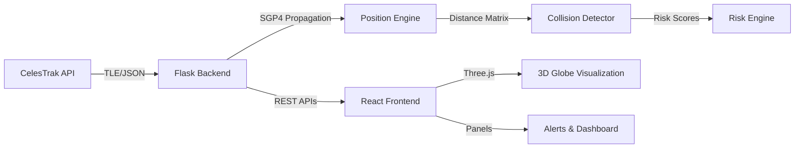

# Forge-X: AI-Based Autonomous Space Traffic Management System

## Overview

A full-stack satellite collision prediction system that fetches **real TLE data** from CelesTrak, propagates orbits using **SGP4**, detects potential collisions, scores risks, and visualizes everything on an interactive **3D Earth globe**.

> [!IMPORTANT]
> **No simulated/hallucinated data.** All satellite data is fetched live from CelesTrak's GP API. The system uses the proper SGP4 propagator for orbit calculations — no shortcuts.

---

## System Architecture



**Data Flow:** CelesTrak TLE → SGP4 Orbit Propagation → Position Calculation (ECI x,y,z) → Pairwise Distance → Collision Detection → Risk Scoring → Dashboard

---

## User Review Required

> [!WARNING]
> **CelesTrak Rate Limits:** CelesTrak enforces strict rate limits (max 1 download per 2-hour update cycle). The backend will cache fetched data locally and only re-fetch when stale (>2 hours). This is both required by CelesTrak policy and good practice.

> [!IMPORTANT]
> **Satellite Groups to Track:** By default, the system will load the `STATIONS` group (~20 objects including ISS) and `ACTIVE` group. For collision detection demos, a smaller curated set (stations + last-launch debris) is recommended. Which groups would you prefer as defaults?

> [!IMPORTANT]
> **Frontend Approach:** I'll use `@react-three/fiber` + `@react-three/drei` for full 3D control (custom Earth textures, satellite markers, orbit trails, collision highlighting). This gives us a premium, custom look versus using a pre-built globe library. Approved?

---

## Proposed Changes

### Backend (Flask + Python)

#### Project Structure
```
backend/
├── app.py                    # Flask app factory + CORS setup
├── config.py                 # Configuration (API URLs, thresholds)
├── requirements.txt          # Python dependencies
├── services/
│   ├── __init__.py
│   ├── tle_service.py        # Fetch & parse TLE data from CelesTrak
│   ├── orbit_service.py      # SGP4 propagation → ECI positions
│   ├── collision_service.py  # Pairwise distance + collision detection
│   └── risk_service.py       # Risk scoring engine (0-100)
├── models/
│   ├── __init__.py
│   └── satellite.py          # Satellite data models
├── routes/
│   ├── __init__.py
│   ├── satellite_routes.py   # /satellites endpoints
│   ├── position_routes.py    # /positions endpoints
│   ├── collision_routes.py   # /collisions endpoints
│   ├── risk_routes.py        # /risk endpoints
│   └── dashboard_routes.py   # /dashboard aggregate endpoint
└── utils/
    ├── __init__.py
    └── cache.py              # Local file caching for TLE data
```

---

#### [NEW] `backend/config.py`
- CelesTrak API base URL: `https://celestrak.org/NORAD/elements/gp.php`
- Default satellite groups: `STATIONS`, `LAST-30-DAYS` (configurable)
- Collision threshold distance: `50 km` (configurable, typical conjunction threshold)
- Warning threshold: `100 km`
- Cache TTL: `7200 seconds` (2 hours — respecting CelesTrak policy)
- SGP4 propagation time step: `60 seconds`
- Prediction window: `24 hours`

#### [NEW] `backend/services/tle_service.py`
- `fetch_tle_data(group: str) -> list[dict]`
  - Hits `https://celestrak.org/NORAD/elements/gp.php?GROUP={group}&FORMAT=JSON`
  - Parses JSON response (OMM format) containing: OBJECT_NAME, NORAD_CAT_ID, EPOCH, MEAN_MOTION, ECCENTRICITY, INCLINATION, RA_OF_ASC_NODE, ARG_OF_PERICENTER, MEAN_ANOMALY, BSTAR, TLE_LINE1, TLE_LINE2
  - Caches to local JSON file with timestamp
  - Returns cached data if cache is fresh (< 2 hours old)
- `get_tle_lines(sat_data: dict) -> tuple[str, str]`
  - Extracts TLE_LINE1 and TLE_LINE2 from OMM JSON

#### [NEW] `backend/services/orbit_service.py`
- `propagate_satellite(tle_line1: str, tle_line2: str, time: datetime) -> dict`
  - Uses `sgp4.api.Satrec.twoline2rv()` to create satellite record
  - Converts datetime → Julian Date using `sgp4.api.jday()`
  - Calls `satellite.sgp4(jd, fr)` → returns position (x,y,z) in km (TEME frame) and velocity
  - Returns `{x, y, z, vx, vy, vz, error_code}`
- `propagate_all(satellites: list, time: datetime) -> list[dict]`
  - Batch propagation for all loaded satellites
- `get_position_series(satellite, start_time, end_time, step_seconds) -> list`
  - For orbit trail visualization, propagates at regular intervals

#### [NEW] `backend/services/collision_service.py`
- `compute_distance(pos1: dict, pos2: dict) -> float`
  - Euclidean distance: `sqrt((x2-x1)² + (y2-y1)² + (z2-z1)²)`
- `detect_collisions(positions: list[dict], threshold_km: float) -> list[dict]`
  - Pairwise distance computation between all satellites
  - Returns list of conjunction events: `{sat1, sat2, distance_km, time, positions}`
  - O(n²) for small sets; for larger sets we can add spatial indexing later
- `predict_collisions(satellites: list, hours_ahead: int, step_seconds: int) -> list`
  - Steps forward in time, checks distances at each step
  - Returns all predicted close approaches within the time window

#### [NEW] `backend/services/risk_service.py`
- `calculate_risk_score(distance_km: float, relative_velocity: float, satellite_size_factor: float) -> int`
  - **Score formula (0-100):**
    - Base score from distance: inversely proportional to distance (closer = higher risk)
    - Velocity factor: higher relative velocity = higher risk (less reaction time)
    - Proximity urgency: exponential increase as distance approaches 0
  - `score = min(100, int(100 * exp(-distance / threshold) * (1 + vel_factor)))`
- `classify_risk(score: int) -> str`
  - 0-30: "LOW" (green)
  - 31-60: "MEDIUM" (yellow)  
  - 61-100: "HIGH" (red)

#### [NEW] `backend/routes/` — REST API Endpoints

| Endpoint | Method | Description | Response |
|---|---|---|---|
| `/api/satellites` | GET | List all loaded satellites | `[{name, norad_id, epoch, ...}]` |
| `/api/satellites/fetch` | POST | Fetch/refresh TLE data from CelesTrak | `{status, count, source}` |
| `/api/positions` | GET | Current positions of all satellites | `[{name, norad_id, x, y, z, lat, lon, alt}]` |
| `/api/positions/<id>` | GET | Position history/trail for one satellite | `[{time, x, y, z}]` |
| `/api/collisions` | GET | Detected collision risks | `[{sat1, sat2, min_distance, time, risk_score}]` |
| `/api/collisions/predict` | GET | Predict collisions for next N hours | `[{sat1, sat2, distance, time, risk}]` |
| `/api/risk` | GET | Risk scores for all satellite pairs | `[{pair, score, classification}]` |
| `/api/dashboard` | GET | Aggregated dashboard data | `{satellites, positions, collisions, risk_summary}` |

---

### Frontend (React + Three.js)

#### Project Structure
```
frontend/
├── public/
│   └── textures/
│       ├── earth_daymap.jpg      # High-res Earth texture
│       ├── earth_nightmap.jpg    # Night lights texture
│       ├── earth_bump.jpg        # Bump map for terrain
│       └── earth_clouds.png     # Cloud layer (transparent)
├── src/
│   ├── App.jsx                   # Main app with layout
│   ├── main.jsx                  # Entry point
│   ├── index.css                 # Global styles + design system
│   ├── components/
│   │   ├── Globe/
│   │   │   ├── Earth.jsx         # 3D Earth sphere with textures
│   │   │   ├── Satellite.jsx     # Individual satellite marker
│   │   │   ├── OrbitTrail.jsx    # Orbit path visualization
│   │   │   ├── CollisionZone.jsx # Highlighted collision risk zones
│   │   │   └── Scene.jsx         # Main Three.js scene orchestrator
│   │   ├── Dashboard/
│   │   │   ├── Dashboard.jsx     # Main dashboard layout
│   │   │   ├── StatsPanel.jsx    # Key metrics cards
│   │   │   └── RiskGauge.jsx     # Visual risk gauge widget
│   │   ├── Alerts/
│   │   │   ├── AlertsPanel.jsx   # Collision alert list
│   │   │   └── AlertCard.jsx     # Individual alert card
│   │   ├── Sidebar/
│   │   │   ├── Sidebar.jsx       # Left sidebar with satellite list
│   │   │   └── SatelliteCard.jsx # Satellite info card
│   │   └── UI/
│   │       ├── Header.jsx        # Top navigation bar
│   │       ├── LoadingScreen.jsx  # Loading state
│   │       └── StatusBadge.jsx   # Risk level badge
│   ├── hooks/
│   │   ├── useAPI.js             # API fetching hooks
│   │   └── useSatelliteData.js   # Satellite data management
│   ├── utils/
│   │   ├── api.js                # Axios instance + API functions
│   │   └── coordinates.js        # ECI → lat/lon/alt conversion
│   └── constants/
│       └── index.js              # Theme colors, Earth radius, etc.
└── package.json
```

---

#### Globe Components (Three.js)

##### [NEW] `Earth.jsx`
- Textured sphere (radius = 1 unit = Earth radius for scale)
- Day map texture + bump map for terrain depth
- Cloud layer (slightly larger transparent sphere, slow rotation)
- Atmosphere glow effect (custom shader or Drei's `<Atmosphere>`)
- Slow auto-rotation with `useFrame`

##### [NEW] `Satellite.jsx`
- Small glowing sphere or icon at (x, y, z) position
- **Color-coded by risk level:** Green (safe), Yellow (medium), Red (high risk)
- Hover tooltip showing: name, NORAD ID, altitude, velocity
- Click to select → shows orbit trail + details panel
- Pulsing animation for high-risk satellites

##### [NEW] `OrbitTrail.jsx`
- `<Line>` geometry showing predicted orbit path
- Color matches satellite risk level
- Fades with distance from current position

##### [NEW] `CollisionZone.jsx`
- Semi-transparent sphere at conjunction point
- Pulsing red glow for high-risk zones
- Size proportional to risk score

##### [NEW] `Scene.jsx`
- Canvas setup with `<OrbitControls>` for camera
- Stars background (`<Stars>` from Drei)
- Ambient + directional lighting (sun-like)
- Composites Earth + all satellite components

---

#### Dashboard Components

##### [NEW] `Dashboard.jsx`
- Split layout: 3D globe (70%) + sidebar panels (30%)
- Dark theme with glassmorphism panels
- Responsive layout

##### [NEW] `StatsPanel.jsx`
- Cards showing: Total satellites tracked, Active alerts, Highest risk score, Last data update
- Animated counters

##### [NEW] `AlertsPanel.jsx`
- Scrollable list of collision events sorted by risk (highest first)
- Each alert: satellite pair names, distance, time to closest approach, risk badge
- Click to zoom camera to conjunction location on globe

##### [NEW] `Sidebar.jsx`
- Searchable list of all tracked satellites
- Filter by: group, risk level, orbit type
- Click to select and highlight on globe

---

#### Design System

- **Color Palette:**
  - Background: `#0a0e1a` (deep space navy)
  - Surface: `rgba(15, 23, 42, 0.8)` (glassmorphism panels)
  - Primary: `#6366f1` (indigo-500)
  - Accent: `#22d3ee` (cyan-400)
  - Risk Low: `#22c55e` (green)
  - Risk Medium: `#f59e0b` (amber)
  - Risk High: `#ef4444` (red)
  - Text: `#e2e8f0` (slate-200)
- **Typography:** Inter (Google Fonts)
- **Effects:** Glassmorphism, subtle glows, smooth transitions, micro-animations

---

## Open Questions

> [!IMPORTANT]
> 1. **Default Satellite Groups:** Should we load `STATIONS` (small, ~20 objects) for quick demos, or `ACTIVE` (10,000+) for realism? I recommend starting with `STATIONS` + a configurable group selector in the UI.

> [!IMPORTANT]  
> 2. **Earth Textures:** I'll use NASA's free Blue Marble textures. These are high-quality, public domain. Alternatively, I can generate stylized textures with the image tool. Preference?

> [!IMPORTANT]
> 3. **Collision Prediction Window:** Default 24 hours with 60-second time steps? This gives good granularity without being too computationally heavy for ~20-50 satellites.

---

## Verification Plan

### Automated Tests
1. **Backend API Tests:**
   - Start Flask dev server
   - Hit each endpoint via browser/curl
   - Verify JSON response structure and data integrity
   
2. **SGP4 Validation:**
   - Propagate ISS (NORAD 25544) and compare position with known reference
   - Verify positions are in reasonable orbital ranges (200-2000 km LEO altitude)

3. **Collision Detection:**
   - Verify distance calculations with known satellite pairs
   - Confirm risk scoring produces correct classifications

### Manual Verification
1. **Frontend Visual:**
   - Launch React dev server
   - Verify 3D globe renders with proper textures
   - Verify satellite positions appear at correct locations
   - Verify collision highlighting and alerts panel
   
2. **End-to-End:**
   - Fetch fresh data from CelesTrak
   - See satellites appear on globe
   - Trigger collision prediction
   - View alerts in real-time

### Build Verification
- `pip install -r requirements.txt` succeeds
- `npm install` + `npm run dev` succeeds
- Both servers run concurrently without errors
